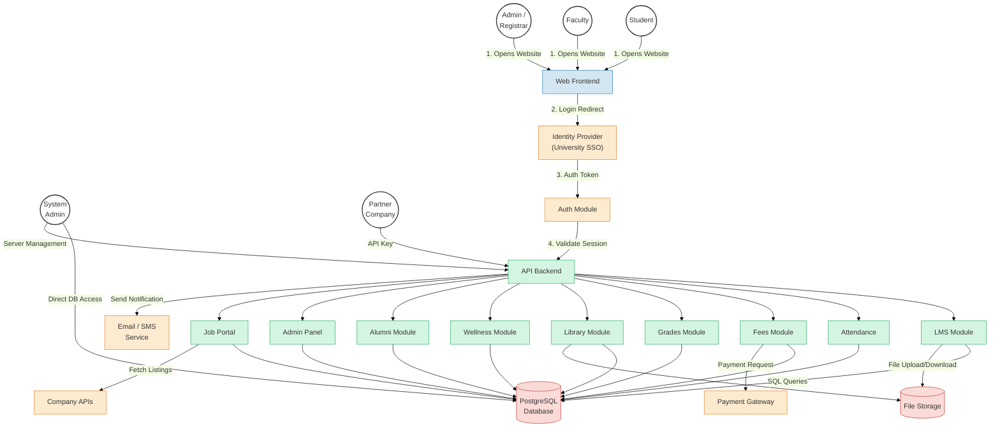
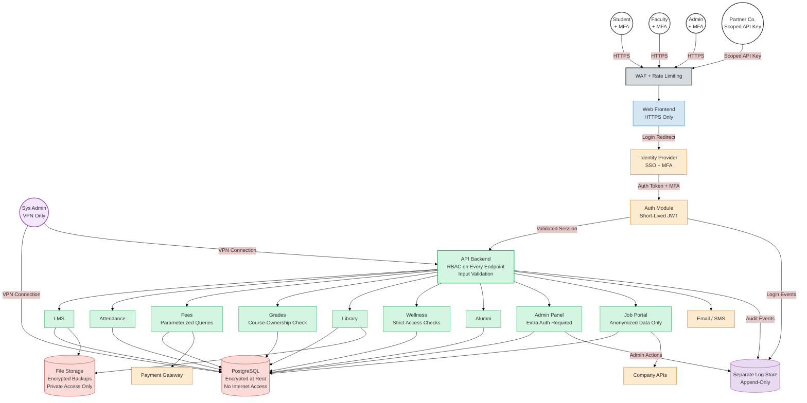

# Secure Architecture Lab — University Management System

> **Scenario:** Option D — University Management System  
> **Threat Modeling Framework:** STRIDE  
> **Author:** Ammar Maqdoom  
> **Date:** February 2026

---

## Table of Contents

1. [Task 1 — System Definition and Architecture](#task-1--system-definition-and-architecture)
2. [Task 2 — Asset Identification and Security Objectives](#task-2--asset-identification-and-security-objectives)
3. [Task 3 — Threat Modeling (STRIDE)](#task-3--threat-modeling-stride)
4. [Task 4 — Secure Architecture Design](#task-4--secure-architecture-design)
5. [Task 5 — Risk Treatment and Residual Risk](#task-5--risk-treatment-and-residual-risk)
6. [Task 6 — Final Report Summary](#task-6--final-report-summary)

---

## Task 1 — System Definition and Architecture

### 1.1 What is This System?

The **UniPortal** is a web-based university management system that lets students, faculty, and administrators handle day-to-day academic tasks online. It covers things like course management (LMS), attendance tracking, fee payments, grade viewing, library access, a wellness/counseling portal, alumni networking, and a job portal where companies can post listings for graduating students.

The system is internet-facing (anyone can reach the login page), and uses role-based access so that different users see different things.

### 1.2 Application Components

| # | Component | What It Does |
|---|-----------|-------------|
| C1 | **Web Frontend** | The website students and faculty interact with. Built as a single-page app served over HTTPS. |
| C2 | **API Backend** | Handles all the business logic. The frontend sends requests here, and it talks to the database. |
| C3 | **Auth Module** | Manages login, logout, and session tokens. Connects to the university's Identity Provider for SSO. |
| C4 | **LMS Module** | Course content, assignments, submissions, and grading. |
| C5 | **Attendance Module** | Faculty marks attendance, students can view their own records. |
| C6 | **Fees Module** | Shows fee invoices, accepts payments through a third-party payment gateway. |
| C7 | **Grades Module** | Stores grades and transcripts. Faculty submit grades, students view them. |
| C8 | **Library Module** | Book catalog, checkout system, digital resources, and fine tracking. |
| C9 | **Wellness Module** | Counseling appointment booking. Stores limited health-related information. |
| C10 | **Alumni Module** | Alumni directory, events, and donation tracking. |
| C11 | **Admin Panel** | Used by the registrar and admins to manage users, roles, enrollments, and system settings. |
| C12 | **Job Portal Module** | Shows job listings from partner companies. Companies push listings via an API. |
| C13 | **Database (PostgreSQL)** | Stores all structured data — users, grades, fees, attendance, etc. |
| C14 | **File Storage** | Stores uploaded files like assignments, course materials, and profile pictures. |

### 1.3 Users and Roles

| Role | What They Can Do |
|------|-----------------|
| **Student** | View courses, submit assignments, check attendance, pay fees, view grades, use library, book wellness appointments, browse job portal |
| **Faculty** | Manage their courses, mark attendance, submit grades, access library, view own salary info |
| **Admin / Registrar** | Manage all users and roles, handle enrollments, configure system settings, view all records |
| **System Admin** | Manage the server, database, and deployments (not a regular app user) |
| **Partner Company** | Post job listings through the API (limited external access) |
| **Anonymous / Public** | Can only see the login page and public course catalog |

### 1.4 Data Types

| Type | Examples |
|------|---------|
| Personal Info (PII) | Names, emails, phone numbers, CNIC/national ID, addresses |
| Academic Data | Grades, transcripts, attendance records, course enrollments |
| Financial Data | Fee payments, salary info, financial aid records |
| Health Data | Counseling appointments, wellness notes (most sensitive) |
| Auth Data | Password hashes, session tokens, JWT secrets |
| System Secrets | Database connection strings, API keys, encryption keys |

### 1.5 External Dependencies

| Dependency | Why We Need It |
|------------|---------------|
| Identity Provider (IdP) | University SSO — students log in with their university account |
| Payment Gateway | Processes tuition fee payments securely |
| Email/SMS Service | Sends notifications (fee reminders, grade alerts) |
| Partner Company APIs | Companies push job listings to the portal |

### 1.6 Architecture Diagram

### 1.7 Trust Boundaries

| Boundary | What It Separates | Why It Matters |
|----------|-------------------|---------------|
| **TB-1: Internet → Frontend** | Public internet from our website | Anyone on the internet can reach the login page. We need to filter bad traffic. |
| **TB-2: Frontend → API Backend** | The user interface from the server logic | Users can't directly call backend functions. Every request must go through the API with a valid session. |
| **TB-3: API Backend → Database** | Application logic from stored data | Only the backend should talk to the database. No user should be able to run SQL queries directly. |
| **TB-4: System → External Services** | Our system from third-party services | Payment gateways, email services, and company APIs are outside our control. We must validate everything going in and out. |

---

## Task 2 — Asset Identification and Security Objectives

### 2.1 Asset Inventory

| ID | Asset | Description |
|----|-------|-------------|
| A-01 | Student PII | Names, emails, phone numbers, national IDs, addresses |
| A-02 | Wellness / Health Records | Counseling appointments, wellness notes |
| A-03 | Academic Records | Grades, transcripts, GPA, attendance history |
| A-04 | Financial Records | Fee payments, salary data, financial aid |
| A-05 | User Credentials | Password hashes, session tokens, JWT secrets |
| A-06 | System Secrets | DB connection strings, API keys, encryption keys |
| A-07 | Course Content | Lecture materials, assignments, digital library resources |
| A-08 | Audit Logs | Records of who did what and when |
| A-09 | System Availability | The system being up and running, especially during exams/registration |
| A-10 | Job Portal Data | Company job listings and student profiles shared with companies |

### 2.2 Mapping Assets to Security Objectives

| Asset | Confidentiality | Integrity | Availability | Accountability |
|-------|:-:|:-:|:-:|:-:|
| A-01 Student PII | **High** — personal data must stay private | **High** — wrong data causes issues | Medium | **High** — must know who accessed it |
| A-02 Wellness Records | **High** — most sensitive data we store | **High** — wrong records can cause harm | Medium | **High** — full audit trail needed |
| A-03 Academic Records | **High** — grades are private | **High** — grade tampering is fraud | **High** — needed during exams | **High** — who changed grades must be tracked |
| A-04 Financial Records | **High** — salary and payment info is private | **High** — tampering means money lost | **High** — needed during fee deadlines | **High** — every transaction logged |
| A-05 User Credentials | **High** — leaked creds = account takeover | **High** — modified creds = unauthorized access | **High** — can't log in if creds are lost | **High** — track all login attempts |
| A-06 System Secrets | **High** — leaked DB string = full breach | **High** — modified secrets break the system | **High** — services need secrets to run | Medium |
| A-07 Course Content | Medium | **High** — tampered materials mislead students | **High** — students need access for learning | Low |
| A-08 Audit Logs | **High** — logs reveal user activity | **High** — tampered logs = no evidence | **High** — needed for investigations | N/A |
| A-09 System Availability | N/A | N/A | **High** — downtime during exams is unacceptable | N/A |
| A-10 Job Portal Data | Medium | Medium | Medium | Medium |

---

## Task 3 — Threat Modeling (STRIDE)

### 3.1 Threat Model Table

| ID | STRIDE | Threat | Affected Component | Affected Asset | Impact | Risk |
|----|--------|--------|--------------------|----------------|--------|:----:|
| T-01 | Spoofing | Attacker steals a student's SSO credentials through a phishing email and logs in as them. | Auth Module, IdP | A-01, A-03, A-05 | Attacker sees victim's grades, PII, and can act as them. | **High** |
| T-02 | Spoofing | Attacker steals or forges a JWT session token and uses it to make API calls. | API Backend, Auth Module | A-05 | Full session hijacking — attacker can do everything the real user can. | **High** |
| T-03 | Spoofing | Someone pretends to be a partner company and sends fake job listings. | Job Portal | A-10 | Students see fake/scam job postings. University reputation is hurt. | **Medium** |
| T-04 | Tampering | A faculty member modifies grades of students who are not in their class. | Grades Module, DB | A-03 | Academic fraud. Wrong grades on transcripts. | **High** |
| T-05 | Tampering | Attacker uses SQL injection to change fee payment records. | Fees Module, DB | A-04 | Financial fraud — students marked as paid when they haven't, or vice versa. | **High** |
| T-06 | Tampering | Attacker or insider deletes or modifies audit logs to hide what they did. | Database, Logs | A-08 | We can't trace who did what. Investigations become impossible. | **High** |
| T-07 | Repudiation | A registrar changes enrollment records and later says "I never did that" because there's no proper logging. | Admin Panel | A-03, A-08 | Disputes can't be resolved. No proof of who made changes. | **Medium** |
| T-08 | Repudiation | Faculty submits a wrong grade and later denies doing it. | Grades Module | A-03, A-08 | Students can't appeal effectively if there's no record. | **Medium** |
| T-09 | Info Disclosure | Database backup files are stored without encryption and someone accesses them. | File Storage | A-01, A-02, A-03, A-04 | Massive data breach — all PII, grades, financial info leaked. | **High** |
| T-10 | Info Disclosure | A student changes the ID in the URL (IDOR) and sees another student's wellness records. | Wellness Module | A-02 | Very sensitive health data exposed. Serious privacy violation. | **High** |
| T-11 | Info Disclosure | API error messages show database table names, file paths, or connection details. | API Backend | A-06 | Attacker gets useful info about our infrastructure to plan further attacks. | **Low** |
| T-12 | Denial of Service | Attacker floods the website with requests during exam result day, crashing the system. | Frontend, API Backend | A-09 | Students can't check results. Major disruption during a critical period. | **High** |
| T-13 | Denial of Service | A large file upload or bulk grade import overwhelms the server. | API Backend, DB | A-09 | System slows down or crashes temporarily. | **Medium** |
| T-14 | Elevation of Privilege | A student figures out the admin API endpoints and accesses the Admin Panel to change their grades. | Admin Panel, API Backend | A-03, A-04 | Student gives themselves better grades or removes fee dues. Complete integrity loss. | **High** |
| T-15 | Elevation of Privilege | A partner company's API key gives them access to full (non-anonymized) student data instead of just what they should see. | Job Portal, API Backend | A-01 | Privacy breach. Company gets student PII without consent. | **High** |

### 3.2 Threat Diagram

```mermaid
%%{init: {'theme': 'base', 'themeVariables': {'primaryColor': '#ffcdd2', 'background': '#ffffff', 'mainBkg': '#ffffff'}}}%%
graph TB
    Attacker(("External\nAttacker"))
    Insider(("Malicious\nInsider"))
    FakeCo(("Fake\nCompany"))

    Frontend["Web Frontend"]
    AuthMod["Auth Module"]
    API["API Backend"]
    Grades["Grades Module"]
    Fees["Fees Module"]
    Wellness["Wellness Module"]
    AdminPanel["Admin Panel"]
    JobPortal["Job Portal"]
    DB[("Database")]
    FileStore[("File Storage")]
    Logs[("Audit Logs")]

    %% External attacker threats
    Attacker -->|"T-01: Phishing\nfor SSO creds"| AuthMod
    Attacker -->|"T-02: Stolen JWT\ntoken replay"| API
    Attacker -->|"T-05: SQL Injection\non fee records"| Fees
    Attacker -->|"T-10: IDOR\nsee others' wellness data"| Wellness
    Attacker -->|"T-11: Trigger\nverbose errors"| API
    Attacker -->|"T-12: DDoS flood\nduring exams"| Frontend
    Attacker -->|"T-14: Access admin\nendpoints as student"| AdminPanel
    Attacker -->|"T-09: Access\nunencrypted backups"| FileStore

    %% Insider threats
    Insider -->|"T-04: Faculty changes\ngrades outside scope"| Grades
    Insider -->|"T-06: Delete/modify\nlogs to cover tracks"| Logs
    Insider -->|"T-07: Registrar denies\nmaking changes"| AdminPanel
    Insider -->|"T-08: Faculty denies\nposting wrong grade"| Grades

    %% Fake company
    FakeCo -->|"T-03: Push fake\njob listings"| JobPortal
    FakeCo -->|"T-15: Over-access\nstudent PII"| JobPortal

    %% DDoS target
    Attacker -->|"T-13: Overload\nwith large uploads"| API

    %% Styling
    style Attacker fill:#e74c3c,stroke:#c0392b,color:#fff
    style Insider fill:#e74c3c,stroke:#c0392b,color:#fff
    style FakeCo fill:#e74c3c,stroke:#c0392b,color:#fff

    style Frontend fill:#d4e6f1,stroke:#2980b9
    style AuthMod fill:#fdebd0,stroke:#e67e22
    style API fill:#d5f5e3,stroke:#27ae60
    style Grades fill:#d5f5e3,stroke:#27ae60
    style Fees fill:#d5f5e3,stroke:#27ae60
    style Wellness fill:#d5f5e3,stroke:#27ae60
    style AdminPanel fill:#d5f5e3,stroke:#27ae60
    style JobPortal fill:#d5f5e3,stroke:#27ae60
    style DB fill:#fadbd8,stroke:#c0392b
    style FileStore fill:#fadbd8,stroke:#c0392b
    style Logs fill:#fadbd8,stroke:#c0392b
```

### 3.3 Risk Reasoning

**Why are most threats rated High?**

The system stores very sensitive data — student PII, health records, grades, and financial information. A breach in any of these areas could lead to legal issues, student harm, or loss of trust. The system is also internet-facing with a large user base (~15,000 students), which increases the chance of attacks.

**High-Risk threats explained:**
- **T-01, T-02 (Spoofing):** If someone can log in as another user, they can see and modify that person's data. Phishing is very common and often works.
- **T-04, T-05 (Tampering):** Changing grades or payment records is basically fraud. This is one of the worst things that can happen.
- **T-06 (Log Tampering):** If logs can be changed, we can't investigate anything. All other controls become useless.
- **T-09 (Backup Exposure):** One misconfigured storage bucket = entire university's data leaked. This happens in real life all the time.
- **T-10 (IDOR on Wellness):** Health data is the most sensitive category. Even a small exposure is a major privacy violation.
- **T-12 (DDoS):** Exam result day already has peak traffic. An attacker timing a DDoS to coincide with this would cause maximum disruption.
- **T-14, T-15 (Privilege Escalation):** If a student can access admin functions, or a company can access full student data, the whole access control system has failed.

**Medium-Risk:** T-03, T-07, T-08, T-13 — these are either less likely or have limited impact compared to the high-risk ones.

**Low-Risk:** T-11 — verbose errors help attackers plan, but don't directly cause damage on their own.

---

## Task 4 — Secure Architecture Design

These are **architectural controls** (design decisions), not code-level fixes.

### 4.1 Identity and Access Management

**Addresses:** T-01, T-02, T-14, T-15

| Control | What It Does | Why |
|---------|-------------|-----|
| SSO with Multi-Factor Auth (MFA) | Users log in through university SSO with a second factor (OTP on phone). | Even if someone phishes a password (T-01), they still can't log in without the OTP. |
| Short-lived JWT tokens | Access tokens expire after 15 minutes. Refresh tokens are rotated. | Limits the window where a stolen token (T-02) is useful. |
| Role-based access control (RBAC) on every endpoint | API checks the user's role before allowing access. Students can't call admin endpoints. Faculty can only grade their own courses. | Directly prevents T-14 (student accessing admin) and T-04 (faculty grading wrong courses). |
| Scoped API keys for companies | Partner companies get API keys that only allow posting job listings and reading anonymized student data. | Prevents T-15 (companies accessing full PII). |

### 4.2 Network Segmentation

**Addresses:** T-12, T-09

| Control | What It Does | Why |
|---------|-------------|-----|
| Separate frontend and backend networks | Frontend is in a public-facing zone. Backend and database are in a private zone that can't be reached directly from the internet. | Even if the frontend is compromised, the attacker can't directly access the database. |
| Database not exposed to the internet | Only the API backend can connect to PostgreSQL. No direct connections from the outside. | Prevents direct SQL attacks and limits blast radius. |
| Admin access through VPN only | System admins must connect through a VPN to access the server or database console. | Keeps admin paths off the public internet. |

### 4.3 Data Protection

**Addresses:** T-05, T-09, T-10

| Control | What It Does | Why |
|---------|-------------|-----|
| Encryption at rest | Database and file storage are encrypted using AES-256. Backups are also encrypted before being stored. | Even if someone gets the backup files (T-09), they can't read the data. |
| HTTPS everywhere (TLS) | All traffic between users and the system uses TLS encryption. | Prevents anyone from intercepting data in transit. |
| Input validation and parameterized queries | All user inputs are validated. Database queries use parameterized statements, not string concatenation. | Directly prevents SQL injection (T-05). |
| Access checks on every data request | When a student requests wellness records, the system checks that the requested record belongs to them. | Prevents IDOR attacks (T-10). |

### 4.4 Secrets Management

**Addresses:** T-06, T-09

| Control | What It Does | Why |
|---------|-------------|-----|
| No secrets in source code | DB passwords, API keys, and JWT secrets are stored in environment variables or a secrets manager — never hardcoded. | If source code is leaked, secrets aren't exposed. |
| Regular secret rotation | Database passwords and API keys are changed on a regular schedule. | If a secret was compromised in the past, rotation limits how long it's useful. |

### 4.5 Monitoring and Logging

**Addresses:** T-06, T-07, T-08, T-11

| Control | What It Does | Why |
|---------|-------------|-----|
| Centralized audit logging | All logins, grade changes, fee modifications, and admin actions are logged to a separate logging system that app users can't modify. | Directly addresses T-06 (log tampering) and T-07/T-08 (repudiation). If logs are separate and append-only, they can't be deleted. |
| Error message sanitization | In production, error messages only show a generic error code. Full details are logged internally. | Prevents T-11 (leaking server info through errors). |
| Alerts on suspicious activity | If there are many failed logins, or someone accesses admin endpoints without the right role, an alert is triggered. | Helps detect attacks like T-01 and T-14 early. |

### 4.6 Secure Deployment

**Addresses:** T-12, T-13

| Control | What It Does | Why |
|---------|-------------|-----|
| Rate limiting | The API limits how many requests a single user/IP can make per minute. | Slows down DDoS attacks (T-12) and prevents abuse (T-13). |
| File upload size limits | Max upload size is enforced (e.g., 10MB). Bulk operations are queued with limits. | Prevents T-13 (overloading the server with huge files). |
| WAF (Web Application Firewall) | A firewall sits in front of the website and filters common attack patterns (SQL injection, XSS, etc.). | Adds an extra defense layer against multiple threats. |

### 4.7 Secure Architecture Diagram

---

## Task 5 — Risk Treatment and Residual Risk

### 5.1 Risk Treatment Table

| Threat | Risk | Treatment | Control Applied | Residual Risk |
|--------|:----:|-----------|----------------|:-------------:|
| T-01: Credential Phishing | High | Mitigate | SSO + MFA | **Medium** |
| T-02: JWT Token Theft | High | Mitigate | Short-lived tokens, rotation | **Low** |
| T-03: Fake Company Listings | Medium | Mitigate | Manual partner verification, scoped API keys | **Low** |
| T-04: Faculty Grade Tampering | High | Mitigate | RBAC with course-ownership checks, audit logs | **Low** |
| T-05: SQL Injection on Fees | High | Mitigate | Parameterized queries, input validation, WAF | **Low** |
| T-06: Audit Log Tampering | High | Mitigate | Separate append-only log store | **Low** |
| T-07: Registrar Repudiation | Medium | Mitigate | Audit logging on all admin actions | **Low** |
| T-08: Faculty Grade Repudiation | Medium | Mitigate | Grade submission events logged with timestamps | **Low** |
| T-09: Unencrypted Backups | High | Mitigate | Encrypted backups, private storage access | **Low** |
| T-10: Wellness Data IDOR | High | Mitigate | Ownership checks on every request | **Low** |
| T-11: Verbose Error Messages | Low | Mitigate | Error sanitization in production | **Negligible** |
| T-12: DDoS During Exams | High | Mitigate | WAF, rate limiting | **Medium** |
| T-13: Server Overload | Medium | Mitigate | File size limits, request throttling | **Low** |
| T-14: Student → Admin Escalation | High | Mitigate | RBAC on every endpoint | **Low** |
| T-15: Company Over-Access | High | Mitigate | Scoped API keys, data anonymization | **Low** |

### 5.2 Why Some Risks Remain

Even with all the controls above, some risks can't be completely eliminated:

1. **Phishing still partially works (T-01 → Medium):** MFA makes phishing much harder, but advanced phishing attacks can sometimes capture the MFA code in real-time. To fully eliminate this, you'd need hardware security keys (like YubiKey) for every user, which isn't realistic for 15,000+ students due to cost.

2. **DDoS can still cause slowdowns (T-12 → Medium):** Rate limiting and WAF help a lot, but a large enough botnet can still overwhelm the system during peak traffic. Fully stopping this would require expensive enterprise-grade DDoS protection that may not be in the budget.

3. **Zero-day vulnerabilities:** There could be unknown bugs in the frameworks and libraries we use (PostgreSQL, Node.js, etc.). We handle this by keeping everything updated, but we can't protect against bugs that haven't been discovered yet.

4. **Third-party risk:** We rely on the Identity Provider, Payment Gateway, and Email service. If any of them get breached, our system is affected too. We can only choose reputable providers and hope for the best.

---

## Task 6 — Final Report Summary

### System Overview

UniPortal is a university management system that serves students, faculty, and administrators. It includes modules for LMS, attendance, fees, grades, library, wellness, alumni, and a job portal. The system is internet-facing with role-based access control.

### What We Found

We identified **15 threats** using the STRIDE framework. **9 were rated High risk**, 4 Medium, and 2 Low. The most dangerous threat areas are authentication (phishing/token theft), privilege escalation (students accessing admin functions), data tampering (grades and fees), and service availability during peak periods.

### Controls We Proposed

1. **Identity & Access:** SSO with MFA, short-lived JWTs, RBAC on every endpoint, scoped API keys for partners.
2. **Network:** Separate frontend/backend zones, database not on the internet, VPN for admin access.
3. **Data Protection:** Encryption at rest and in transit, input validation, parameterized queries, ownership-based access checks.
4. **Secrets:** No hardcoded secrets, regular rotation.
5. **Monitoring:** Centralized append-only audit logs, error sanitization, alerts on suspicious activity.
6. **Deployment:** WAF, rate limiting, file upload limits.

### What's Still At Risk

Two threats remain at Medium residual risk: phishing (hard to fully stop without hardware keys) and DDoS (hard to fully stop without very expensive solutions). We also depend on third-party services and can't control their security.

### Assumptions

- The university's Identity Provider is properly set up and secure.
- The Payment Gateway is PCI-DSS compliant.
- TLS and AES-256 encryption are still secure (no known breaks).
- We have someone monitoring the alerts and logs.

### Limitations

- This threat model doesn't cover physical security (stolen laptops, etc.).
- We can't control what's on the user's device (malware, bad browser extensions).
- This is a point-in-time analysis — it should be revisited when the system changes significantly.
